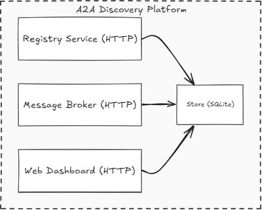

# A2A Discovery Platform

A complete Agent-to-Agent (A2A) Discovery Platform built in Go. Agents can register, discover each other, and exchange tasks through a REST API.

## Features

- **Agent Registry**: Register agents with capabilities, endpoints, and metadata
- **Service Discovery**: Find agents by capability for dynamic task routing
- **Message Broker**: Route tasks between agents with status tracking
- **Health Monitoring**: Automatic health checks with heartbeat TTL
- **Web Dashboard**: Real-time monitoring of agents and tasks
- **CLI Tool**: Command-line interface for platform management
- **Go SDK**: Easy-to-use SDK for building agents

## Architecture



## Quick Start

### Prerequisites

- Go 1.25+
- Make (optional)

### Installation

```bash
# Clone the repository
git clone https://github.com/Sithumli/Beacon.git
cd Beacon

# Download dependencies
go mod download

# Build all binaries
make build
```

### Running the Server

```bash
# Run with SQLite storage (default)
./bin/a2a-server

# Run with in-memory storage
./bin/a2a-server --memory

# Custom port
./bin/a2a-server --port 8080
```

The server starts on `http://localhost:8080` with both the API and dashboard.

### Running Example Agents

```bash
# In a new terminal - start the echo agent
./bin/echo-agent --server localhost:8080

# In another terminal - start the code agent (requires Ollama)
./bin/code-agent --server localhost:8080 --ollama-url http://localhost:11434
```

### Using the CLI

```bash
# List all agents
./bin/a2a agents list

# Get agent details
./bin/a2a agents get <agent-id>

# Discover agents by capability
./bin/a2a discover echo

# Send a task
./bin/a2a task send -c echo -p '{"message": "hello"}' -w

# Check task status
./bin/a2a task status <task-id>
```

## Building Agents with the SDK

```go
package main

import (
    "context"
    "encoding/json"
    "github.com/Sithumli/Beacon/pkg/sdk"
)

func main() {
    // Build the agent
    agent := sdk.NewAgent("MyAgent").
        WithVersion("1.0.0").
        WithDescription("My custom agent").
        WithEndpoint("localhost", 50052).
        WithCapability("greet", "Greets the user", handleGreet).
        Build()

    // Register and start
    agent.Register("localhost:8080")
    agent.Start(context.Background())
}

func handleGreet(ctx context.Context, payload json.RawMessage) (json.RawMessage, error) {
    var req struct {
        Name string `json:"name"`
    }
    json.Unmarshal(payload, &req)

    resp := map[string]string{
        "greeting": "Hello, " + req.Name + "!",
    }
    return json.Marshal(resp)
}
```

## API Reference

### Registry API

| Method | Endpoint | Description |
|--------|----------|-------------|
| POST | `/api/v1/agents` | Register a new agent |
| GET | `/api/v1/agents` | List all agents |
| GET | `/api/v1/agents/:id` | Get agent details |
| DELETE | `/api/v1/agents/:id` | Deregister an agent |
| GET | `/api/v1/discover?capability=X` | Find agents by capability |
| POST | `/api/v1/heartbeat` | Send agent heartbeat |

### Broker API

| Method | Endpoint | Description |
|--------|----------|-------------|
| POST | `/api/v1/tasks` | Send task to specific agent |
| GET | `/api/v1/tasks` | List all tasks |
| GET | `/api/v1/tasks/:id` | Get task details |
| PATCH | `/api/v1/tasks/:id` | Update task status/result |
| POST | `/api/v1/tasks/:id/cancel` | Cancel a task |
| POST | `/api/v1/route` | Route task to any capable agent |

### Dashboard API

| Method | Endpoint | Description |
|--------|----------|-------------|
| GET | `/api/agents` | List all agents (dashboard) |
| GET | `/api/tasks` | List all tasks (dashboard) |
| GET | `/api/stats` | Get platform statistics |

## Configuration

### Server Flags

| Flag | Default | Description |
|------|---------|-------------|
| `--port` | 8080 | HTTP server port |
| `--db` | a2a.db | SQLite database path |
| `--memory` | false | Use in-memory storage |
| `--debug` | false | Enable debug logging |

## Project Structure

```
a2a-platform/
├── cmd/
│   ├── server/          # Main server binary
│   └── a2a/             # CLI tool
├── internal/
│   ├── core/            # Core models (Agent, Task, Capability)
│   ├── registry/        # Registry service
│   ├── broker/          # Message broker
│   ├── store/           # Data layer (SQLite, Memory)
│   └── health/          # Health monitoring
├── pkg/
│   └── sdk/             # Go SDK for building agents
├── api/
│   └── proto/           # Protocol buffer definitions (for future gRPC)
├── web/                 # Web dashboard
├── examples/
│   ├── echo-agent/      # Simple echo agent
│   └── code-agent/      # LLM-powered code agent
├── go.mod
├── Makefile
└── README.md
```

## Development

### Build

```bash
make build          # Build all binaries
make build-server   # Build server only
make build-cli      # Build CLI only
```

### Run Tests

```bash
make test           # Run all tests
make test-cover     # Run tests with coverage
```

### Run Server

```bash
make run           # Run with SQLite
make run-memory    # Run with in-memory storage
```

### Run Example Agents

```bash
make run-echo      # Run echo agent
make run-code      # Run code agent
```

## Task Status Flow

```
pending → running → completed
                  → failed
                  → cancelled
```

## Example: Registering an Agent

```bash
curl -X POST http://localhost:8080/api/v1/agents \
  -H "Content-Type: application/json" \
  -d '{
    "name": "MyAgent",
    "version": "1.0.0",
    "description": "My test agent",
    "endpoint": {
      "host": "localhost",
      "port": 50052,
      "protocol": "http"
    },
    "capabilities": [
      {
        "name": "echo",
        "description": "Echo back the input"
      }
    ],
    "metadata": {
      "author": "dex",
      "tags": ["test", "demo"]
    }
  }'
```

## Example: Sending a Task

```bash
curl -X POST http://localhost:8080/api/v1/route \
  -H "Content-Type: application/json" \
  -d '{
    "from_agent": "cli",
    "capability": "echo",
    "payload": {
      "message": "Hello, World!"
    }
  }'
```

## License

MIT License
